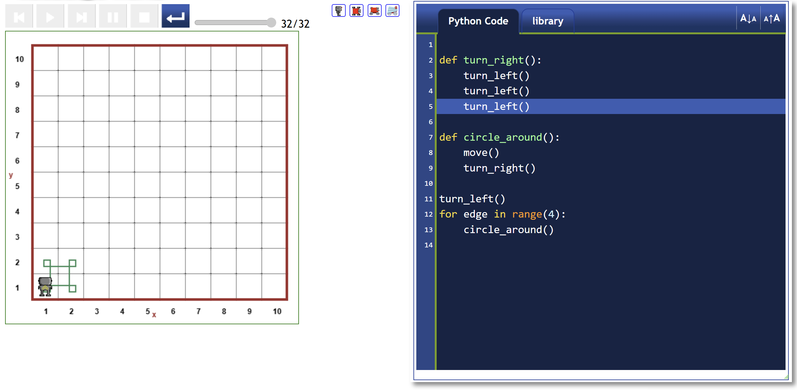
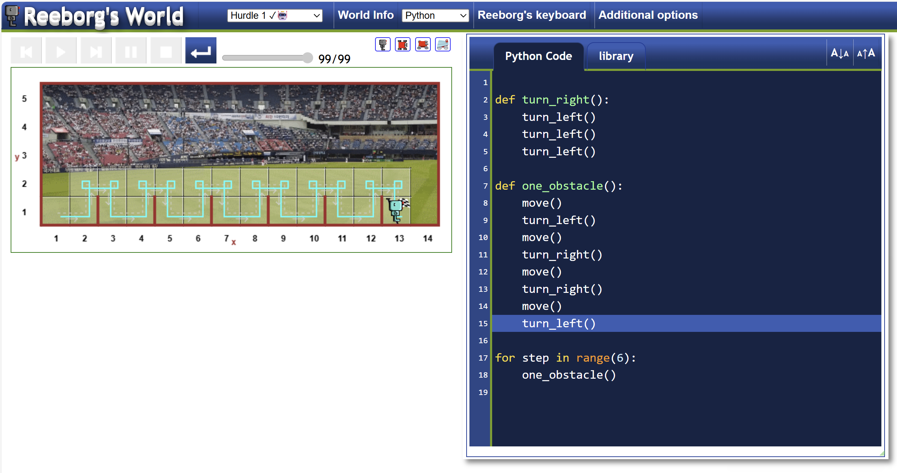
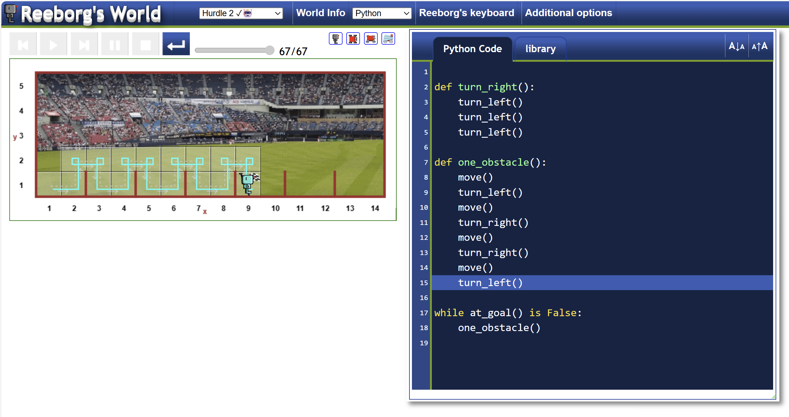
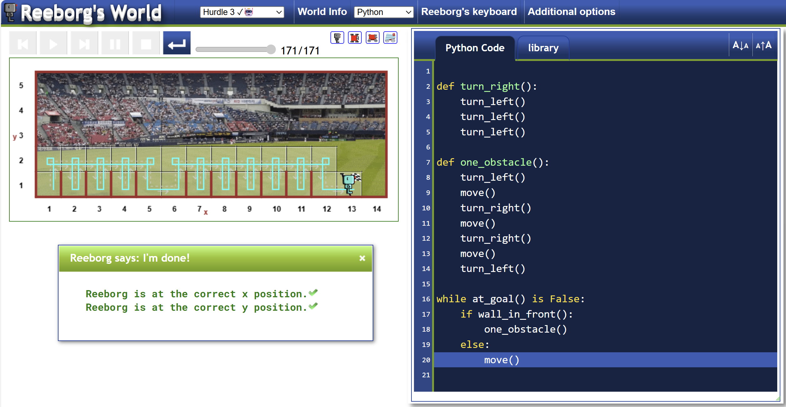
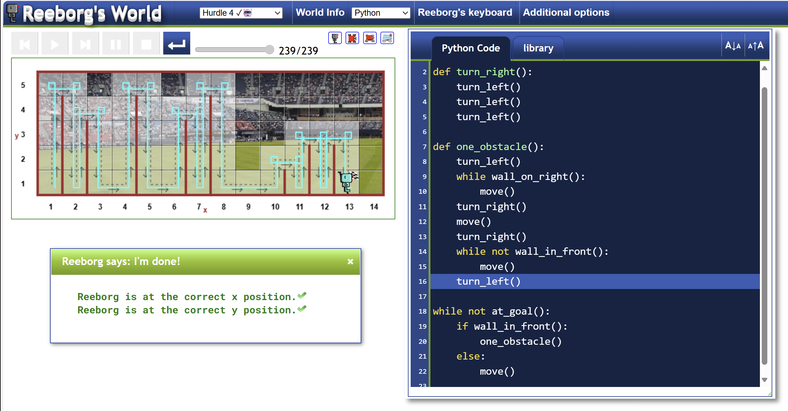

# Day 6

---

##  Challenge 1

For this challenge the objective is to draw a square with the robot with functions 
and drawing squares in th edges because the robot needs to be looking at the right place.

The code for the resolution of the challenge is shown bellow:

---

## Challenge 2

The challenge 2 is about getting the robot to cross acros an obstacle course using the 
functions and making the code the most concise it can be.

After 18 lines of code the result is the next.

---

## Challenge 3

Next challenge was to make the robot determine on his own if he is in the goal or not and 
keep on going until it reaches the end, even when the position of the goal is in a random position.

This time it was necessary to use the while loop with a new variable at_goal(), to determine if the robot has reach
his goal, or he has to keep oon going.

Next image show the result run and the code to reach the goal each time.

The resolution of Angela is more clean, will keep that in mind using the 

> while not at_goal()

---

## Challenge 4

For challenge 4 the hurdle is now even more complicated. using the while loop to check for the condition of the finished 
line I had to also check if there was a wall in front, or it was clear to the robot will be able to make the right "desition"
of using the move() function or using the jump for one obstacle.
I tried to make it short and to the point and I think it worked.

---

## Challenge 5

The hurdle 4 for this challenge in the reeborg's world is now to change the jump function based on the height of the obstacle.

This challenge took a couple of iterations. The first while loop to check if there was a wall on the right to keep on moving 
to pass the total height of the obstacle was easy, the second while loop didn't even cross my mind. Having to go back to the bottom
of the map was more straight forward when I noticed the robot doing wild things.

---

## Challenge 6

